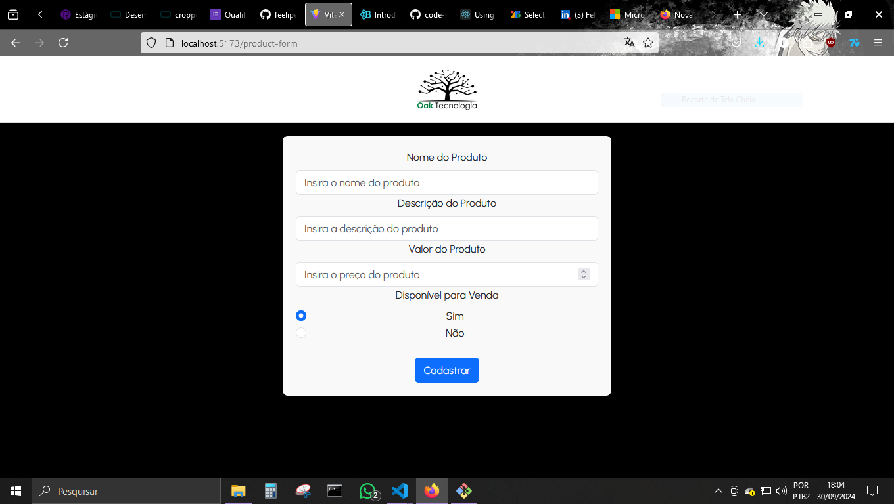
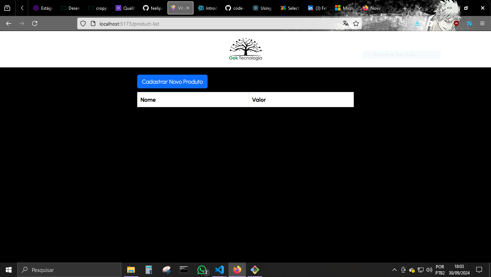

# processo-seletivo-oak
Processo Seletivo Oak Tecnologia

Linguagem/framework utilizada(o): React.js

O projeto não foi feito com local storage, então, dependendo da página que estiver, caso seja recarregada aparecerá um erro e perderá as informações já cadastradas.

# Página Home:

# Página Cadastro de Produtos:

# Página Listagem de Produtos:

